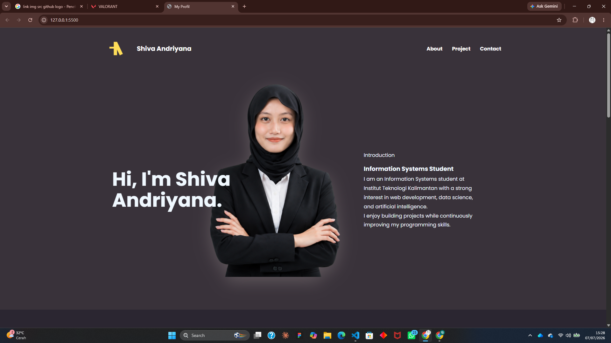
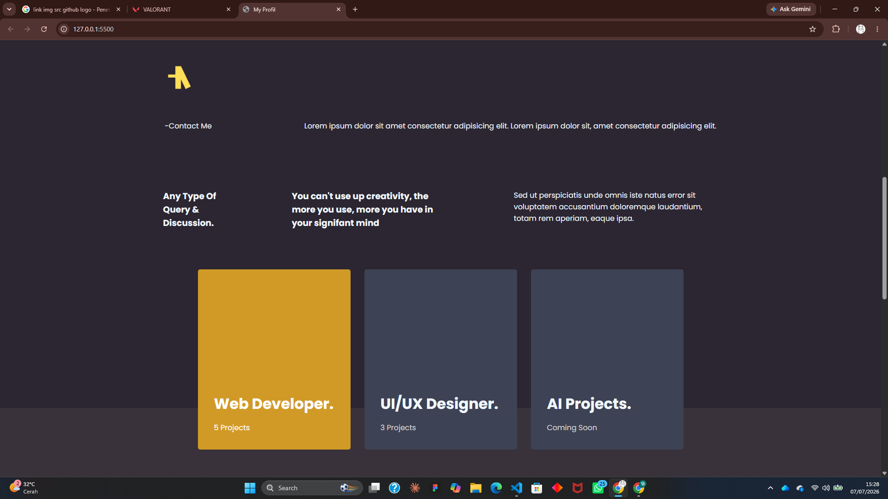
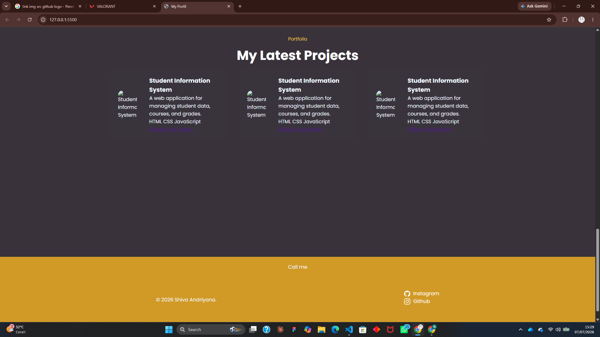

# Personal Portfolio Website

My first personal portfolio website built using HTML and CSS.

## About The Project

This project is a personal portfolio website created to showcase my profile, skills, and projects. It is also part of my learning journey in web development, focusing on building a solid understanding of HTML structure and CSS layout techniques.

The website contains:

- Hero Section
- About Me Section
- Services Section
- Projects Section
- Contact Section
- Footer with Social Media Links

**Hero Section**


**About**


**Footer**


## Built With

- HTML5
- CSS3
- Flexbox

## Learning Objectives

Through this project, I practiced:

- Semantic HTML structure
- CSS styling
- Flexbox layout
- Responsive design fundamentals
- Organizing files and folders
- Building a complete landing page from scratch

## Project Structure

```
HALAMAN-PROFIL-PRIBADI/
├── img/
│   ├── AI-ANA-SHADOW.png
│   ├── AI-ANA-USE.png
│   └── LOGO-ANA.png
├── style/
│   ├── about.css
│   ├── body.css
│   ├── footer.css
│   ├── header.css
│   ├── hero.css
│   └── proyek.css
├── index.html
├── README.md
└── style.css
```

## Notes from lerrning this

- First, dont too **addict to understand everything**.
- Second, learn thing that just **important** such us yeah u know lah, you've already learn, if u forget just search or ask ai.
- Third, dont try to **memorized all** of this escpecially about styling.
- Fourth, beacause in this era we have an ai to styling more easier and help us learn quickly (u just need to know, its okay if u forget)
- Fifth, next time focus on purpose about program that u build rather just make random project.
- at the end *"Be always consistent <3"*

## Author

**Shiva Andriyana**

Information Systems Student  
Institut Teknologi Kalimantan

GitHub:
https://github.com/anawithcode

Instagram:
https://www.instagram.com/shvndryn
